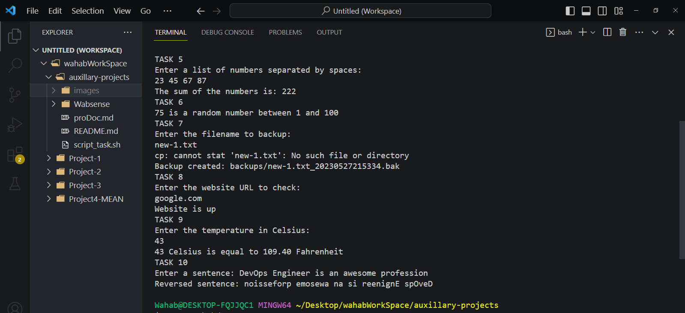
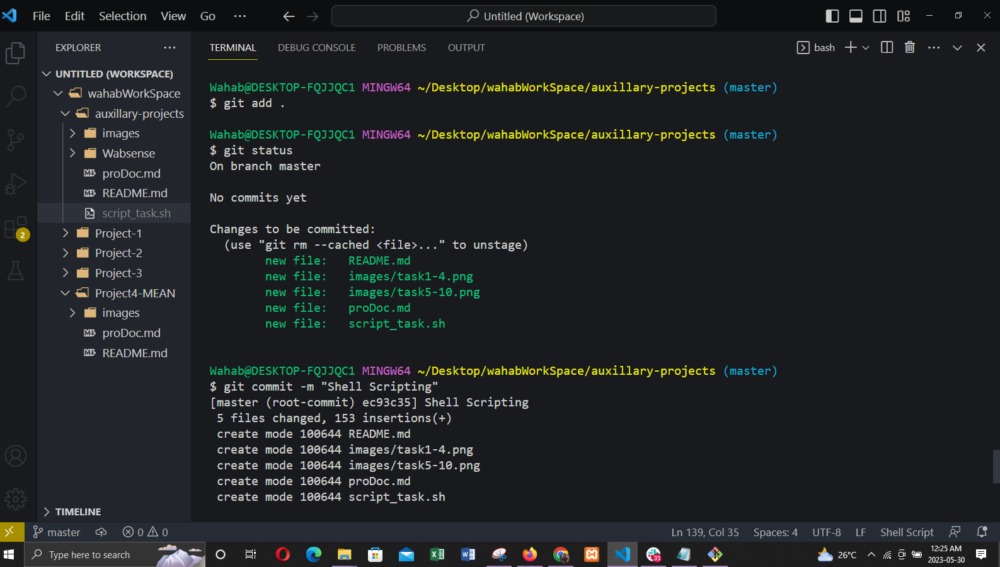

# PROJECT DOCUMENTATION

### Images showing how the tasks is being run.

### Image that shows how the project is being committed to git

### Below is the video link
### https://www.loom.com/share/e3d39ff95e6b4a45b327635d85adf807
